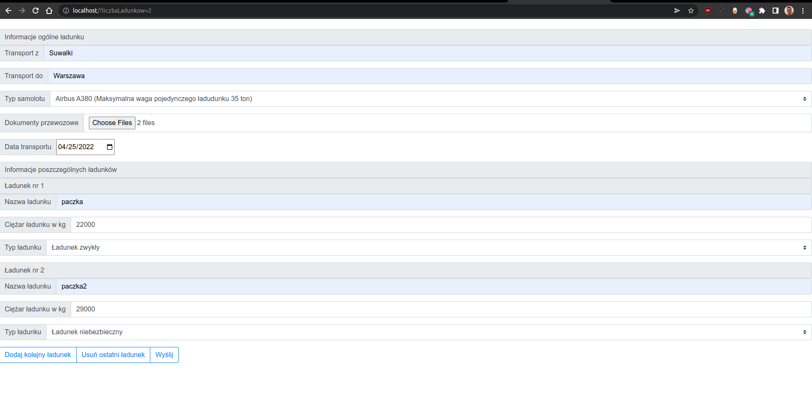
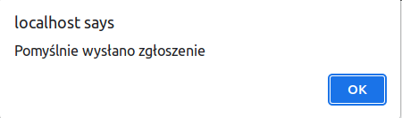
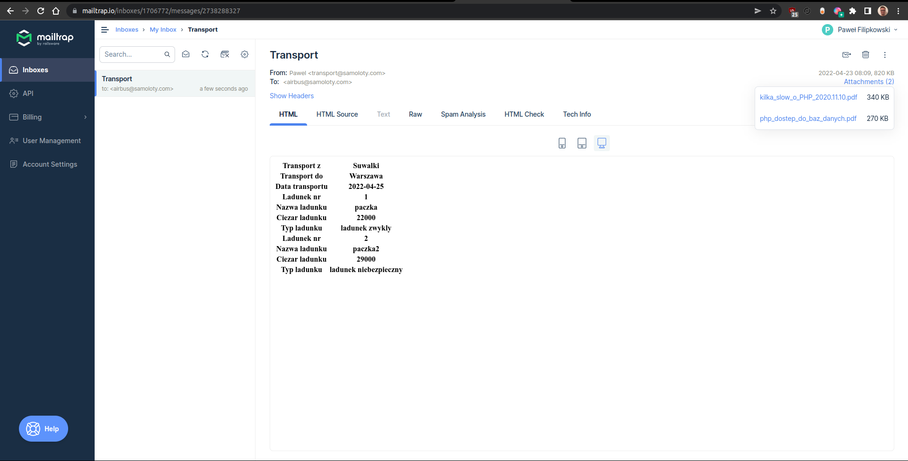
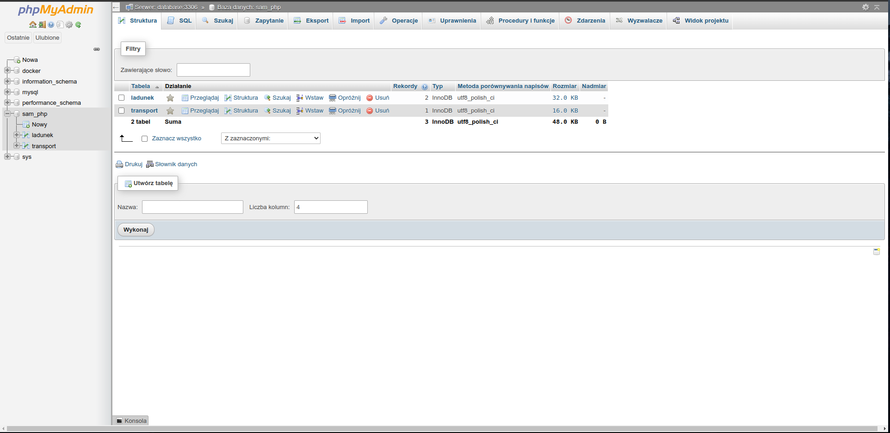
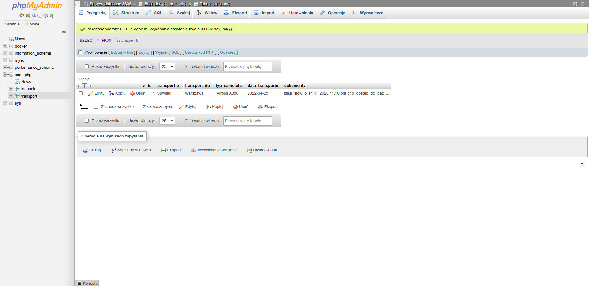
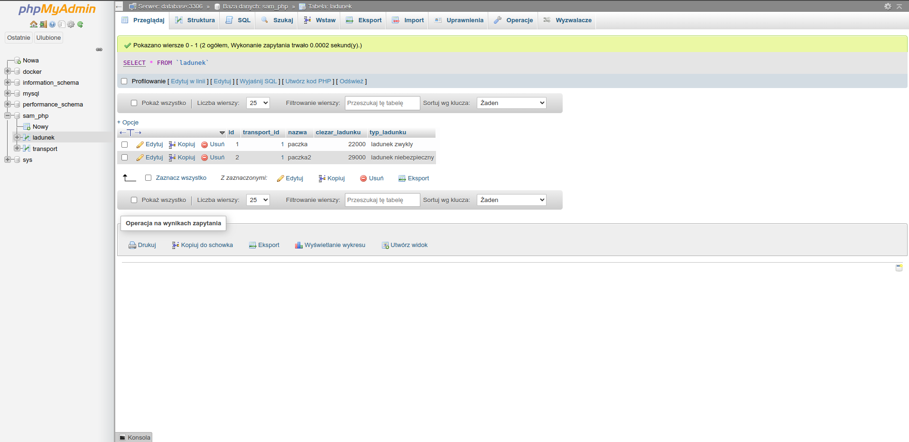
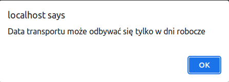
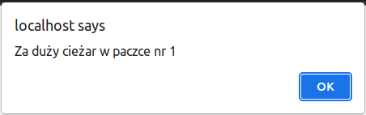

# Recruitment task in php

It consists of the following:

* PHP
* Nginx
* MySQL
* phpMyAdmin

## Installation

* Clone this repository on your local computer
* Configure .env as needed
* Run the `docker-compose up -d`.
* Install required packages inside docker container


```shell
git clone https://github.com/Pawebf1/sam-php.git
cd sam-php/
cp sample.env .env
sudo docker-compose up -d
sudo docker exec -it sam-php_app_1 bash
```

```shell
composer install
// visit localhost
```

## Screenshots








## Possible errors



